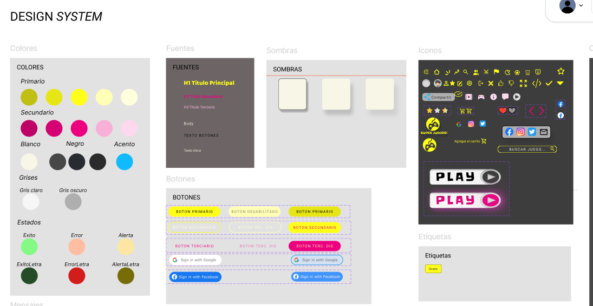
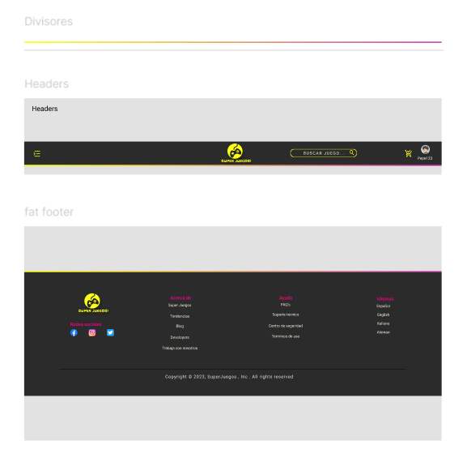
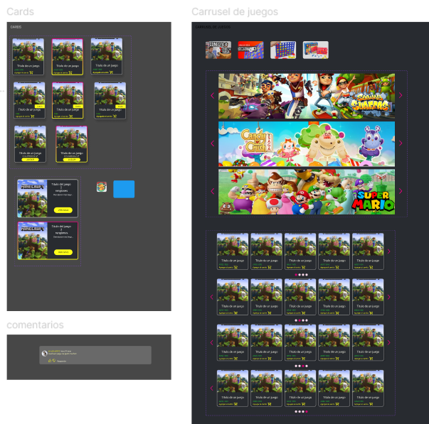
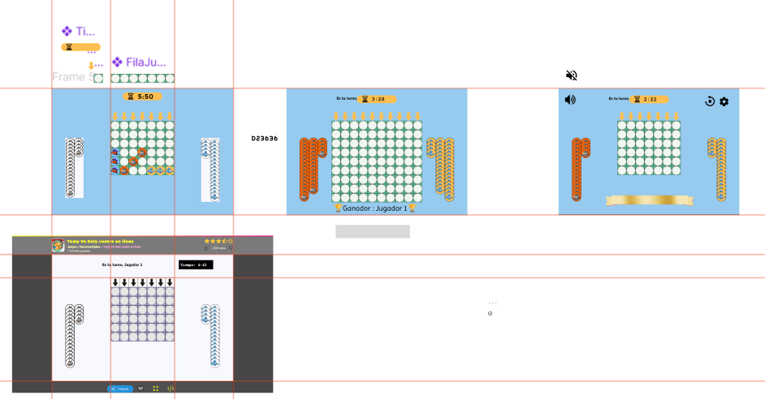
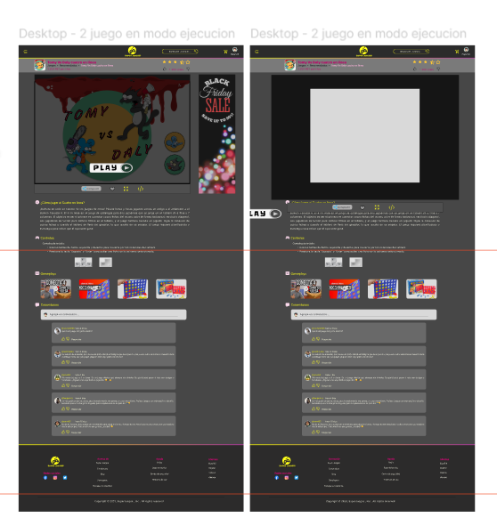
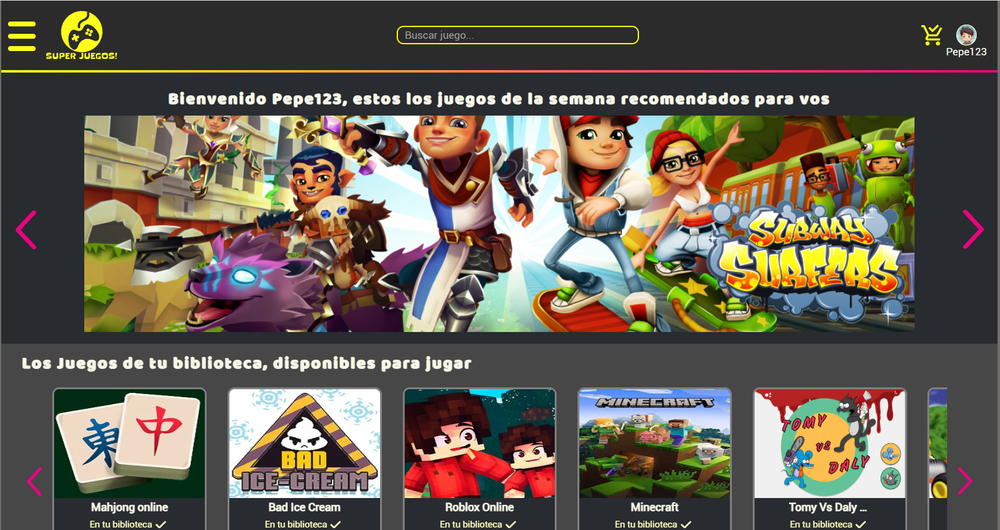

# Trabajos Prácticos - Interfaces de Usuario (TUDAI 2023) 💻✨

Este repositorio contiene los proyectos desarrollados para la materia Interfaces de Usuario de la Tecnicatura Universitaria en Desarrollo de Aplicaciones Informáticas (TUDAI). A lo largo de la cursada se trabajó desde la etapa de diseño de experiencia de usuario (UX/UI) hasta el desarrollo frontend e interactivo de los sitios.

---

## 📐 [Trabajo Práctico 1](https://florenciavivar.github.io/interfaces/tp1/) - Prototipo & Design System
Desarrollo de un prototipo interactivo de alta fidelidad en Figma y creación de un Design System completo.
- **Herramientas utilizadas:** Figma, Componentes, Variantes, Auto-layout.
- **Enfoque:** UX/UI, Arquitectura de la información y consistencia visual.

### Galería de Diseños (Figma)

  
  
  
  
  

---

## 🌐 [Trabajo Práctico 2](https://florenciavivar.github.io/interfaces/tp2/) - Maquetación Web
Desarrollo del diseño y la maquetación fluida de la plataforma web.
- **Tecnologías utilizadas:** HTML5, CSS3, JavaScript (Vanilla).
- **Enfoque:** Diseño responsive, semántica web y maquetación fluida.

### Galería de la Web

  
  
  
  
  

---

## 🎮 [Trabajo Práctico 3](https://florenciavivar.github.io/interfaces/tp3/) - Juego "Cuatro en Línea" (Tom vs. Daly)
Desarrollo del clásico juego "Cuatro en línea de Tomy Vs Daly" ubicado de manera destacada en el primer carrusel del home.
- **Tecnologías utilizadas:** HTML5 Canvas, JavaScript Avanzado.
- **Enfoque:** Lógica de juego, detección de colisiones, manipulación del DOM y animaciones en tiempo real.

### Galería del Juego

  
  
  

---

## 🕷️ [Trabajo Práctico 4](https://florenciavivar.github.io/interfaces/tp4/) - Experiencia Inmersiva "Spidey"
Implementación de diseño "Spidey" propuesto utilizando efectos visuales y de movimiento avanzados.
- **Tecnologías utilizadas:** CSS3 Avanzado (Keyframes, Animaciones, Transiciones), Efecto Parallax.
- **Enfoque:** Microinteracciones, rendimiento de animaciones y experiencia inmersiva.

### Galería de Spidey

  
  

